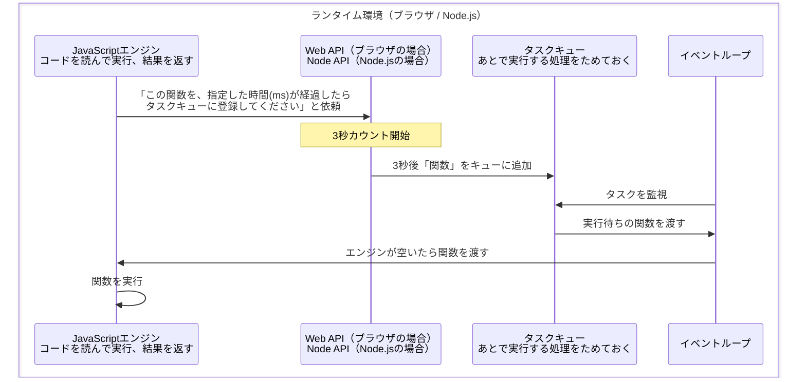

```mermaid
sequenceDiagram
    box ランタイム環境（ブラウザ / Node.js）<br/>
        participant JS as JavaScriptエンジン<br/>コードを読んで実行、結果を返す
        participant API as Web API（ブラウザの場合）<br/>Node API（Node.jsの場合）
        participant Queue as タスクキュー<br/>あとで実行する処理をためておく
        participant EL as イベントループ
    end

    JS->>API: 「この関数を、指定した時間(ms)が経過したら<br/>タスクキューに登録してください」と依頼
    note over API: 3秒カウント開始

    API->>Queue: 3秒後「関数」をキューに追加
    EL->>Queue: タスクを監視
    Queue->>EL: 実行待ちの関数を渡す
    EL->>JS: エンジンが空いたら関数を渡す
    JS->>JS: 関数を実行
```
